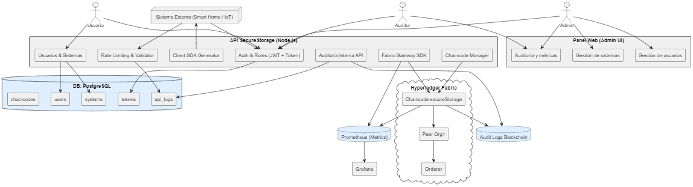

# ✅ FASE 0 – **Objetivo y Principios Fundamentales del Sistema**

---

## 🎯 1. OBJETIVO GENERAL

Construir una plataforma centralizada y segura (API backend + Fabric) que permita a:

* **Usuarios humanos** (administradores, auditores, operadores)
* **Sistemas automáticos** (IoT, servicios, terceros)

interactuar con una red Hyperledger Fabric **de forma segura, auditada y controlada**, aprovechando al máximo las capacidades de la blockchain: **integridad, trazabilidad, disponibilidad y no repudio**.

---

## 🧱 2. ARQUITECTURA GENERAL

**🔐 API de Seguridad y Orquestación (Node.js)**

* Punto único de entrada a la blockchain
* Orquestador de usuarios, sistemas, chaincode y auditoría
* Controla identidades, permisos y acceso a Fabric

**📦 Blockchain Hyperledger Fabric**

* Red permissioned con chaincodes en Go
* Control de acceso por organización / identidad
* Auditabilidad y trazabilidad nativa

**🗃 Base de Datos (PostgreSQL)**

* Persistencia extendida fuera del ledger (usuarios, sistemas, logs API)
* Soporte a roles, tokens, y estados no críticos

**🖥 Frontend (posterior)**

* Panel de administración + auditoría
* Integración con Prometheus/Grafana

---

## 🔐 3. PRINCIPIOS DE SEGURIDAD Y BLOCKCHAIN

| Propiedad          | Cómo se aplica                                                                                                                                                                         |
| ------------------ | -------------------------------------------------------------------------------------------------------------------------------------------------------------------------------------- |
| **Auditoría**      | - Logs detallados de cada acción en la API - Transacciones con `TxID`, `timestamp`, y firmadas por identidad Fabric - Acceso exclusivo del rol *Auditor* a ver todo el historial |
| **Integridad**     | - Solo datos cifrados son almacenados en Fabric - Se almacenan hashes o firmas si se requiere validar integridad fuera de cadena                                                    |
| **No repudio**     | - Toda interacción con Fabric está firmada digitalmente por identidades únicas (usuarios o sistemas) - Cada operación puede ser atribuida de forma inmutable                        |
| **Disponibilidad** | - API centralizada protegida por rate-limiting y validación - Redis o caché si se requiere disponibilidad extrema - Fabric soporta tolerancia a fallos por diseño                |

---

## 👥 4. ACTORES DEL SISTEMA

### 👨‍💼 Usuarios humanos (autenticación con JWT)

* **Administrador**:

  * Control total del sistema y blockchain
  * Puede ver/crear/modificar sistemas, identidades y chaincodes
  * Accede a auditoría y monitoreo

* **Auditor**:

  * Solo lectura de logs API y blockchain
  * No puede interactuar con sistemas o cambiar nada

* **Usuario estándar**:

  * Puede registrar sus propios sistemas
  * Ver logs de actividad de su sistema
  * Recibe token y/o SDK de integración

---

### 🤖 Sistemas conectados (autenticación por token)

* Cada sistema (por ejemplo, una Smart Home) está representado por:

  * Un **`systemID`**
  * Un **token seguro de acceso**
  * Relación con un usuario propietario

* **Solo puede usar los endpoints específicos `/store-event`, `/store-state`**

* No puede interactuar con Fabric directamente: todo pasa por la API

---

## 🧭 5. LÍMITES Y RESPONSABILIDADES

| Componente            | Rol                                                                   |
| --------------------- | --------------------------------------------------------------------- |
| **API (Node.js)**     | Centraliza validaciones, seguridad, monitoreo, orquestación de Fabric |
| **Fabric**            | Guarda datos cifrados, provee integridad, trazabilidad y no repudio   |
| **Base de datos**     | Administra usuarios, sistemas, tokens, auditoría de la API            |
| **Frontend (futuro)** | Brinda visualización, gestión, dashboards                             |

---

## ⚠️ 6. DESAFÍOS ESPERADOS Y SOLUCIONES

| Riesgo                       | Prevención / Diseño                                                 |
| ---------------------------- | ------------------------------------------------------------------- |
| DDoS por sistemas maliciosos | Rate limit + tokens firmados + auditoría                            |
| Suplantación de identidad    | Autenticación basada en JWT + certificados únicos                   |
| Corrupción de datos          | Cifrado extremo-a-extremo + solo escritura desde API                |
| Auditoría manipulada         | Logs firmados o hasheados + acceso solo lectura por auditor         |
| Exceso de complejidad        | Uso de patrones como Strategy, modularidad, scaffolding de clientes |

---

## 🧩 7. MODULARIDAD Y ESCALABILIDAD

* **Sistemas** pueden integrarse fácilmente: cada uno recibe su `token` y/o SDK generado automáticamente
* **Chaincode** puede tener funciones genéricas: `StoreEvent(systemID, encryptedPayload)` y `StoreSnapshot(...)`
* **Panel web** puede crecer por módulos: usuarios, sistemas, logs, estadísticas
* **Monitorización** embebida con Prometheus/Grafana permite visión en tiempo real

---

## 🛑 8. CRITERIOS DE ÉXITO ANTES DE PASAR A FASE 1

✅ Identificación clara de roles y actores
✅ Reglas de seguridad y acceso bien definidas
✅ Lógica de interacción API ↔ Fabric trazada
✅ Comprobado que la API **centraliza todo acceso**
✅ Aprobada la estructura general de logs, usuarios y sistemas
✅ Aprobada arquitectura técnica general

---

