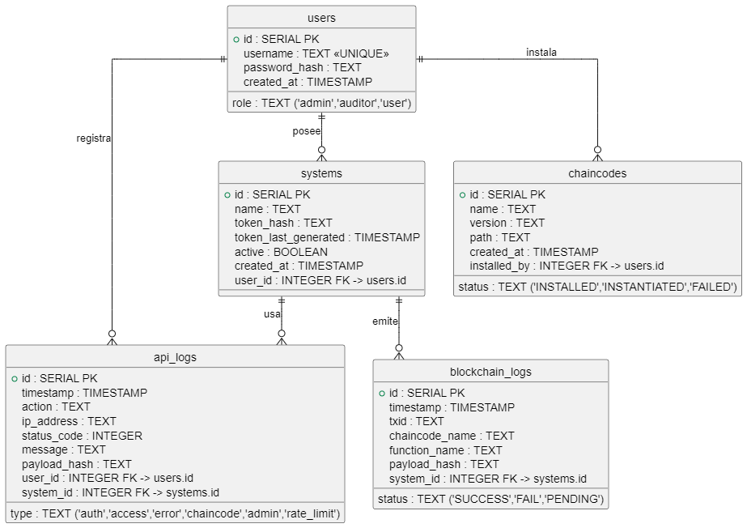

# ✅ FASE 2 – Persistencia con PostgreSQL

---

## 🎯 Objetivo general

Diseñar una **base de datos robusta, segura y normalizada** en PostgreSQL para:

* Gestionar **usuarios, sistemas y tokens**
* Registrar **auditoría completa de la API**
* Llevar el historial de interacción con la blockchain
* Soportar generación de clientes, instalación de chaincode y trazabilidad

---

## ⚙️ Motor de base de datos: **PostgreSQL**

### ¿Por qué PostgreSQL?

| Ventaja           | Justificación                                              |
| ----------------- | ---------------------------------------------------------- |
| 🔐 Seguridad      | Roles, TLS, cifrado, funciones firmadas                    |
| 💪 Rendimiento    | Indexación potente, JSONB, consultas complejas             |
| 🧩 Extensibilidad | Soporte para audit, roles, triggers, vistas                |
| 🔎 Observabilidad | Pg\_stat\_statements, integración con Prometheus exporters |
| 🛡️ Cifrado       | Compatible con `pgcrypto`, FIPS 140-2 (cuando se usa bien) |

---

## 🧱 MODELO DE DATOS (ESQUEMA RELACIONAL)

### 🔐 `users`

```sql
id SERIAL PRIMARY KEY
username TEXT UNIQUE NOT NULL
password_hash TEXT NOT NULL
role TEXT CHECK (role IN ('admin', 'auditor', 'user')) NOT NULL
created_at TIMESTAMP DEFAULT NOW()
```

### 🤖 `systems`

```sql
id SERIAL PRIMARY KEY
name TEXT NOT NULL
user_id INTEGER REFERENCES users(id) ON DELETE CASCADE
token_hash TEXT NOT NULL
token_last_generated TIMESTAMP
active BOOLEAN DEFAULT TRUE
created_at TIMESTAMP DEFAULT NOW()
```

> **token\_hash**: el token del sistema se guarda hasheado con SHA-256 o Argon2

### 📜 `api_logs`

```sql
id SERIAL PRIMARY KEY
timestamp TIMESTAMP DEFAULT NOW()
type TEXT CHECK (type IN ('auth', 'access', 'error', 'chaincode', 'admin', 'rate_limit')) NOT NULL
action TEXT NOT NULL
user_id INTEGER REFERENCES users(id) ON DELETE SET NULL
system_id INTEGER REFERENCES systems(id) ON DELETE SET NULL
ip_address TEXT
status_code INTEGER
message TEXT
payload_hash TEXT
```

> Este log sirve para auditar toda la actividad API, incluyendo errores y ataques.

### 🔗 `blockchain_logs`

```sql
id SERIAL PRIMARY KEY
timestamp TIMESTAMP DEFAULT NOW()
txid TEXT NOT NULL
system_id INTEGER REFERENCES systems(id) ON DELETE SET NULL
chaincode_name TEXT NOT NULL
function_name TEXT
payload_hash TEXT
status TEXT CHECK (status IN ('SUCCESS', 'FAIL', 'PENDING')) NOT NULL
```

> Este log refleja lo que fue enviado a Fabric y qué resultado devolvió.

### 🧩 `chaincodes`

```sql
id SERIAL PRIMARY KEY
name TEXT NOT NULL
version TEXT NOT NULL
installed_by INTEGER REFERENCES users(id) ON DELETE SET NULL
status TEXT CHECK (status IN ('INSTALLED', 'INSTANTIATED', 'FAILED')) DEFAULT 'INSTALLED'
path TEXT NOT NULL
created_at TIMESTAMP DEFAULT NOW()
```

> Permite que los administradores instalen chaincode desde la API y puedan controlar su estado.

---

## 🧠 RELACIONES ENTRE TABLAS

* Un **usuario** puede tener varios **sistemas**
* Un **sistema** genera muchos **logs API** y **logs de blockchain**
* Los **logs** pueden estar asociados a un `user_id`, `system_id` o ambos
* **Usuarios admin** instalan **chaincodes**

---

## 🧪 SEGURIDAD A NIVEL DE BD

| Medida                  | Cómo aplicarla                                                    |
| ----------------------- | ----------------------------------------------------------------- |
| 🔒 Tokens hasheados     | Nunca guardar tokens en texto plano (`SHA-256` mínimo o `Argon2`) |
| 🔐 Roles por acceso     | PostgreSQL soporta roles de conexión y schema scoping             |
| 🧩 Cifrado sensible     | Si se guarda metadata crítica: usar `pgcrypto`                    |
| 🔍 Logging estructurado | Exportar logs API en formato JSON para Grafana/Prometheus         |
| 🧯 Retención            | Política de TTL o archivado para `api_logs` si crecen mucho       |

---

## 📦 INTEGRACIÓN CON NODE.JS

### ORM recomendado: **Sequelize** o **Prisma**

* Sequelize es maduro, ampliamente usado
* Prisma ofrece tipos estrictos, buena experiencia con TypeScript (si decides usarlo)

**Recomendación:** Prisma si usas TypeScript — Sequelize si estás con JavaScript puro

---

## 📈 INDEXACIÓN Y PERFORMANCE

* `users.username` → UNIQUE index
* `systems.token_hash` → index
* `blockchain_logs.txid` → UNIQUE index
* `api_logs.timestamp` → index para auditoría
* `api_logs.type` + `status_code` → compound index para métricas

---

## 🚦 MIGRACIONES Y SEEDING

Herramientas recomendadas:

* Prisma Migrate (si usas Prisma)
* Sequelize CLI (con migraciones estructuradas)
* pgAdmin para visualización si prefieres UI

---

## 🧭 FINAL DE FASE 2: ENTREGABLES ESPERADOS

✅ Diagrama ERD
✅ Script SQL de creación de tablas o migraciones definidas
✅ Decisión sobre ORM y motor elegido
✅ Relación usuario ↔ sistema ↔ blockchain establecida
✅ Política de logs documentada
✅ Validaciones de seguridad de tokens y contraseñas establecidas

---



## 🧾 Script SQL — Creación de tablas completas

* Totalmente normalizados
* Con relaciones correctas (`FOREIGN KEY`)
* Con restricciones de seguridad (`CHECK`, `UNIQUE`, `NOT NULL`)
* Preparados para auditoría y trazabilidad

```sql
-- Tabla: users
CREATE TABLE users (
  id SERIAL PRIMARY KEY,
  username TEXT NOT NULL UNIQUE,
  password_hash TEXT NOT NULL,
  role TEXT NOT NULL CHECK (role IN ('admin', 'auditor', 'user')),
  created_at TIMESTAMP DEFAULT CURRENT_TIMESTAMP
);

-- Tabla: systems
CREATE TABLE systems (
  id SERIAL PRIMARY KEY,
  name TEXT NOT NULL,
  user_id INTEGER NOT NULL REFERENCES users(id) ON DELETE CASCADE,
  token_hash TEXT NOT NULL,
  token_last_generated TIMESTAMP,
  active BOOLEAN DEFAULT TRUE,
  created_at TIMESTAMP DEFAULT CURRENT_TIMESTAMP
);

-- Tabla: api_logs
CREATE TABLE api_logs (
  id SERIAL PRIMARY KEY,
  timestamp TIMESTAMP DEFAULT CURRENT_TIMESTAMP,
  type TEXT NOT NULL CHECK (type IN ('auth', 'access', 'error', 'chaincode', 'admin', 'rate_limit')),
  action TEXT NOT NULL,
  user_id INTEGER REFERENCES users(id) ON DELETE SET NULL,
  system_id INTEGER REFERENCES systems(id) ON DELETE SET NULL,
  ip_address TEXT,
  status_code INTEGER,
  message TEXT,
  payload_hash TEXT
);

-- Tabla: blockchain_logs
CREATE TABLE blockchain_logs (
  id SERIAL PRIMARY KEY,
  timestamp TIMESTAMP DEFAULT CURRENT_TIMESTAMP,
  txid TEXT NOT NULL,
  system_id INTEGER REFERENCES systems(id) ON DELETE SET NULL,
  chaincode_name TEXT NOT NULL,
  function_name TEXT,
  payload_hash TEXT,
  status TEXT NOT NULL CHECK (status IN ('SUCCESS', 'FAIL', 'PENDING'))
);

-- Tabla: chaincodes
CREATE TABLE chaincodes (
  id SERIAL PRIMARY KEY,
  name TEXT NOT NULL,
  version TEXT NOT NULL,
  installed_by INTEGER REFERENCES users(id) ON DELETE SET NULL,
  status TEXT DEFAULT 'INSTALLED' CHECK (status IN ('INSTALLED', 'INSTANTIATED', 'FAILED')),
  path TEXT NOT NULL,
  created_at TIMESTAMP DEFAULT CURRENT_TIMESTAMP
);
```

---

## 🔍 Índices adicionales recomendados

```sql
-- Índices para rendimiento
CREATE INDEX idx_users_username ON users(username);
CREATE INDEX idx_systems_token_hash ON systems(token_hash);
CREATE INDEX idx_blockchain_logs_txid ON blockchain_logs(txid);
CREATE INDEX idx_api_logs_timestamp ON api_logs(timestamp);
CREATE INDEX idx_api_logs_type_status ON api_logs(type, status_code);
```

---

## ✅ Notas finales

* Los `token_hash` se almacenan de forma segura, no como texto plano.
* Los `logs` se vinculan con `user_id` y `system_id` (pueden ser `NULL` para registros sin actor directo).
* Los `CHECK` aseguran integridad semántica de los valores (`role`, `status`, etc.).
